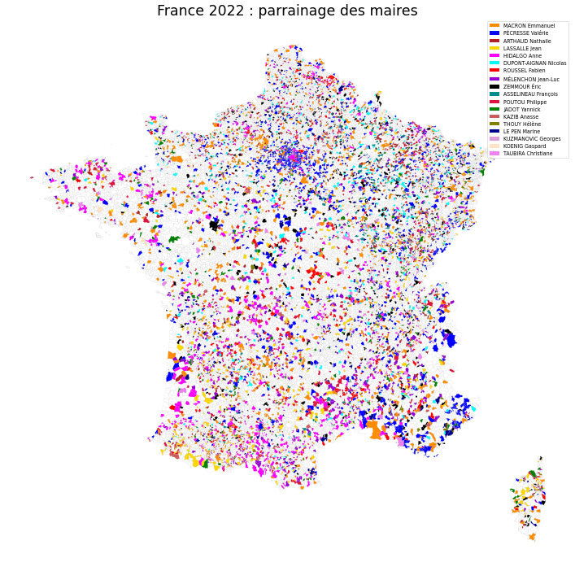
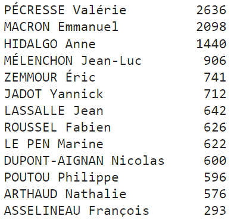

# 2022 French mayor sponsorships (latest update: 24/02/22)

Visualization of French mayor's sponsorships for the French presidential election of 2022. Chosen candidates are displayed on a map of metropolitan French towns ("communes").

Example: plot candidates on map

Example 2: top 10 candidates 

## Running the tests

Run the notebook demo_mayor_sponsorship to visualize sponsorships for each town of metropolitan France

## Built With

The following Python libraries are used in these notebooks:
* [pandas](https://pandas.pydata.org/) - Python Data Analysis Library
* [GeoPandas](https://geopandas.org/en/stable/) - GeoPandas is an open source project which extends the datatypes used by pandas to allow spatial operations on geometric types.

## Versions

This code was tested with following versions:
* demo_mayor_sponsorship: Python 3.9.4, geopandas 0.10.2, pandas 1.3.4

## Authors

* **Thomas Dubot** 

## License

This project is licensed under the MIT License - see the [LICENSE.md](LICENSE.md) file for details

## Acknowledgments

All data are open source data provided by the French open source data portal: https://www.data.gouv.fr/fr/

